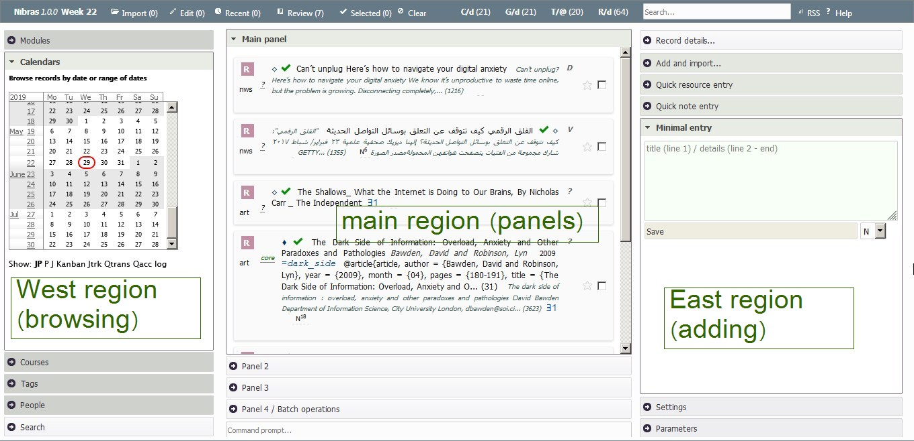
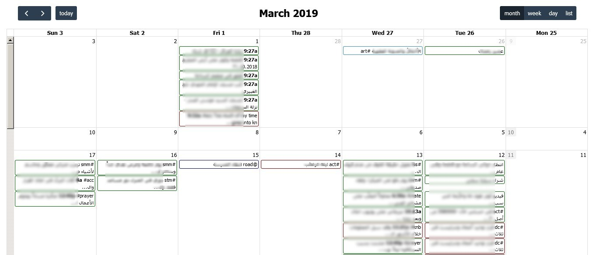

# Interface

Nibras is a one-screen application, with 4 regions: north, east, west, and main, in addition to calendar pages and few custom sub-apps.

## Regions and panels

**Screen regions**

### Panels

The west panel has many subpanels:

**Courses panel** lists the active courses, grouped by their departments.

**Modules panel** lists the saved searches, grouped by their module.

**Calendar panel**

Clicking on a date in the calendar shows the records created in that date, as well as other records related to the date.

<!-- module code is often the first character of the default module name. You can change the name from the settings.

G Goals
T Tasks
...

S Contacts, people, or society

* Saved search. Wide and narrow box presentation.

* Kanban

in planning work or study

w kanban refreshes every 120 seconds. config.

in studying kanban too

* Calendar
* Dashboard

The main pages are the main page, publish, kanban, cal, kpi, the rest is shown in the central region.

b1 kanban

getings things entered framework, vs my focus and sequence driven kanban.

Effective cycle of printing a book draft. making lots of editing and amendments. Updating the writings. Printing again.
A book is split into writings and or notes. 
 -->

## Calendar page

The calendar page shows the journal and planner records, as well as the notes and resouces read withtin a specific time frame. 

It is available from the "Calendar" link in the north region of the application.

** A sample month view of the calendar**

** A sample week view of the calendar**

The user can add an event to the calendar after selecting a region in the week or day view of the calendar. The text entered can be a free text, in which case a journal record is created with the text as its title, or can be a Nibras command to add more metadata for the record. The command can start with **j** or **p** to create a journal or planner record, respectively.

## Record display
The record in Nibras can be displayed in full and short form. The full form is the default.

**Example** of a full form of a resource (book) record, and under it are the actions buttons. They are displayed when the cursor is over the form.

**Short form** is used in places like tables, to reduce the space occupied by the records. 

	

<!-- The main interface is composed of three regions: left, top and central regions.

The left region contains the calendar, the search form, the modules menu and the parameters list.

Command bar: add, update, find ad hoc/HQL, search full text,

Main search form

Quick add

Top right: import and export, calendars, update indicators?, help, batch add

Menu and saved searches e.g. countdown and countups, tables for export

_summary, details
for TGRE, add J or P with optional summary text and a date

book covers
link to files -->

## Keyboards Shortcuts
Some keyboards shortcuts were implemented to speed up nagivation across the application controls, and to toggle the visibility of the panels.

**Esc** (escape): moves focus (cursor) and cursor to the quick search field.

**F7**: moves focus (cursor) and cursor to the bottom main command line.

**Ctrl + arrows**: hides/shows the panel corresponding to the arrow:
* **left arrow**: west region.
* **right arrow**: east region.
* **top arrow**: north region.

