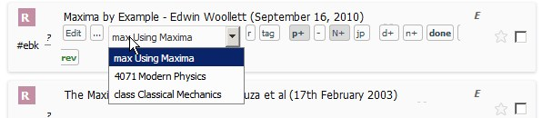
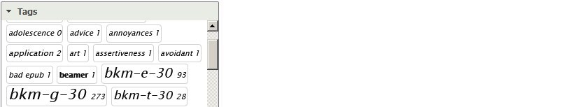

# Records and Data Model

<!--
 Each module has a one-letter code, e.g. G for goals, and a color code e.g. dark green for goals. You can see the letter and color codes from accordion in the west region.

Often the module code is the first letter of the module name

G (goals), T (tasks), C (notes, historically index '''c'''ards), W (writings), ...

diagram
sns

To group tasks, Pomegranate supports up to 3 levels of parents. Goals, Courses and Department.

 -->

<!-- **Fields** -->

<!-- . Definitions of typical types. -->

Certain fields are common to all module records:
* Summary
* Description
* Priority
* Type
* Bookmarked
* Date created and last updated

Other fields are particular to certain modules:
* Start and end dates (journal and planner).
* Completed date, planned and actual duration, percent completed  (for tasks and goals).
* Author, ISBN, published on, publication city, etc. (for resources).
* Blog (for writings and notes).

**Departments and courses**

Department and course can assign any record.

<!-- 
One of the goals of a system is show us our progress in quantitative ways and immediate way.

Explanation of each journal, planner, goal type

Pomegranate balance between flexible hierarchy, unlimited nesting and flexbile query to the user and simpler implementation to the developer -->

<!-- 

notes:

contact integration @contact

task, goal, notes can be linked to the person defined in the People module. the person need not be a user of the application. It can be the person with whom you got the notes, heard a piece of advice, or seen him/her doing things differently than your way.

GTP
JI
RES
WN

so 
planning,
journaling, progress tracking,
study and research,
writing and publishing

decomposition,
GT
WN
RE
 -->
 

## Comments and tags
A comment can be added to any module record.

And any module record can have one or more tags.
<!--  -->

You can see all records tagged with a certain tag from the Tags panel in the west region.

<!-- 
Arbitrary relationships
In addition to the relationships among the different modules set by the data model structure, one can link any two records from any module by ad hoc relationships. The relationship has a parametric type. 

If you link A to B, then when you see B, you will see it linked in reverse order to A. For example if A is a prerequisite for B, then B follows after A. You need to defines the name of the reverse relationship in the parameters too. -->

