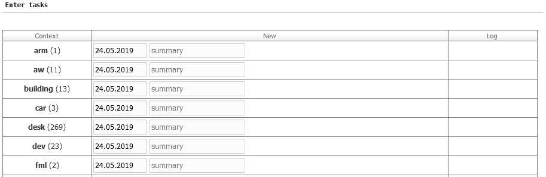
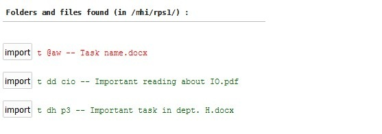

# Adding

You can add records through forms, sheets, commands, and by importing files named in Nibras command format.

## Forms

Example of adding a new task:

 

**Custom forms**
The east regions contains 3 forms, each in its own panel, to quickly add a resource, a note, or a record with only summary and description. This speed up data entry, and reduce the navigation needed to enter a new record. It also provides the most common fields, and so shorten the entry form.

**Quick resource entry**

**Quick note entry**

**Minimal entry**

## Sheet
It is available for tasks, payments, and journal.It allows quick adding of many records of different types in one screen.

## Commands

You can add records through the command bar. Adding through commands will be explained in the Commands section.

## Import 

You can add records by importing files named in the command notation.

<!-- [import-menu.jpg](./images/import-menu.jpg) -->

To import files, you need to rename them as if they are *add commands*, without the command type **a**. So a file named `t p3 -- Paper to read` create the same record that the command 'a t p3 -- Paper to read` creates. The next 3 screenshot illustrate this process.

**1 - Sample files to import**

**2- The files as seen inside Nibras import screen**

**3 - The result of importing**

<!-- 
Import options

 -->

