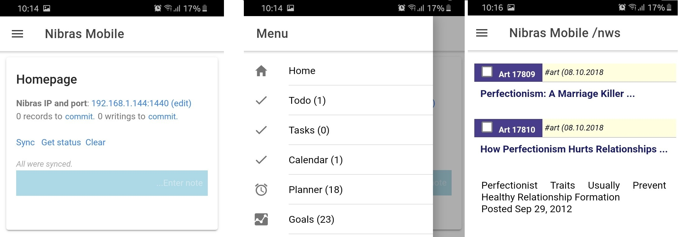

# Nibras Reader

* **Nibras Reader** is an Android application that connects to a Nibras PKM system (e.g. on the same WIFI network), and gets the bookmarked records in key modules.

* It allows the user to enter quick one-line notes that will be synced to Nibras Desktop on user's choice.

* To use Nibras Reader, the user has to specify first the IP and port of Nibras PKM (found on the footer region). Then, when clicking 'Sync', all bookmarked records will be available for reading on mobile.

* Google Play link: 
[https://play.google.com/store/apps/details?id=khuta.org.nibras.mobile]
(https://play.google.com/store/apps/details?id=khuta.org.nibras.mobile)

* To get it, download and install the .apk release found on its website: 
[https://github.com/mfakih294/nibras-mobile]
(https://github.com/mfakih294/nibras-mobile).

