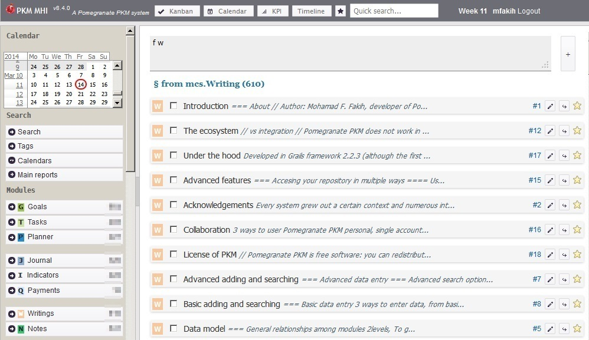

# Main Features

* **Flexible text-based commands** to add, update and search records, which provides powerful ways to manage information.
* **Saved searches** to save searches for later use.
* Ability to display records on calendars and Kanban boards.
* Full-text search of all record fields.
* Simple file system integration so to greatly reduce the need to organize files manually.

## Technical details

* Nibras is developed in Grails framework 3.3.10, a dynamic framework on top of the Java platform.
* Grails applications run on any platform that can run Java 8 and later, so practically all platforms, including Windows, Linux, Mac.
* For production use, Nibras uses MySQL 5+ for its database, and the file system to store the files of the records. To testing and demonstration, it can run with h2 database, with zero extra configuration.
* Apache Tomcat 8+ is the recommended application server to run it for production use.
* The bundled distribution comes with Tomcat 8 and runs with a h2 database.

<!-- Target users
Users who are committed to long term organization of their personal information, planning, and productivity, and willing to invest time to learn a new system.
Average computer-skilled person can use the data entry and search forms.
Advanced users (not necessarily programmers) can use the advanced features of Nibras, and are the main target users.
Although users can get up and running with it in few hours, the real and major benefits comes with time. -->
<!-- Willing to adjust and adapt to a new system to fit their needs. -->

<!-- Are managing big and dynamic volume of information or documents -->

## History

* Version 1 was in 2009 as a small web application to manage code snippets (notes), as part of project-based study of web development. It was initially based on Grails 1.1.
* From versions 2 to 14, development continued with frequent expansions in application scope and features. Many features were abandoned or redesigned.
* Version 6.5 was the first stable version to be use daily and reliably. Version 8 was the first public release after a major and comprehensive code cleaning and interface tweaking.
* Version 14.9 was the second public release, and it was reset to 1.0.0.

