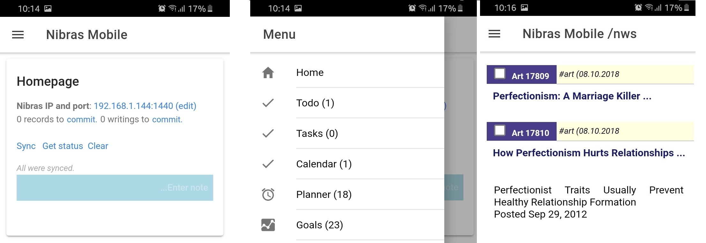

## Nibras Mobile

* **Nibras Mobile Reader** is a companion Android application 
to Nibras. It connects to a Nibras PKM system, over a WIFI network, and gets the bookmarked records in it,
 so you can read them without network access whenever you go.

* It  also allows the user to enter new records, that will be synced to Nibras Desktop when connected together.

* To use Nibras Reader, you need to specify first the IP and port of Nibras PKM (found on the footer region). Then, when clicking 'Sync', all bookmarked records will be available for reading on mobile.

* To get it, download the **apk** file found on its website: 
[https://github.com/mfakih294/nibras-mobile]
(https://github.com/mfakih294/nibras-mobile).

* Then copy the download apk file to your Android phone, and install it.

