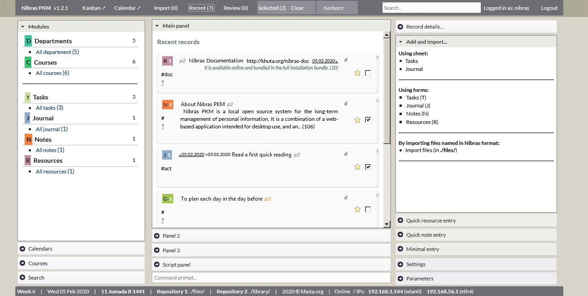

# Welcome to Nibras System Documentation

Nibras system consists of Nibras PKM and Nibras Reader.

## Nibras PKM 

**Nibras PKM** is an __offline open source system__ for the __long-term management__ of __personal__ information. It is a combination of a __web-based__ application intended for desktop use, and an Android __mobile__ reader application.

**Why offline?** The user has full control over his/her data, without the need for (fast) internet connection, and without all the distractions and information overload that the internet can cause.

**Why open source?** The user has control over the system itself too, especially when using it on the long term to manage the important personal information and files.

**It manages**: resources (articles, books, documents), notes, writings, tasks, goals, journal, planner, payments, indicators, and (study) courses and departments.

* Documentation: [https://mfakih294.github.io/Nibras-PKM/](https://mfakih294.github.io/Nibras-PKM/).
* Code, releases and issues: [https://github.com/mfakih294/Nibras-PKM](https://github.com/mfakih294/Nibras-PKM).

## Nibras Reader

* **Nibras Reader** is available as a browser application and as an Android application. It that connects to a Nibras PKM system (e.g. on the same WIFI network), and gets the bookmarked records in key modules.

* It  also allows the user to enter quick one-line notes that will be synced to Nibras Desktop on user's choice.

* To use Nibras Reader, the user has to specify first the IP and port of Nibras PKM (found on the footer region). Then, when clicking 'Sync', all bookmarked records will be available for reading on mobile.

* Google Play link: 
[https://play.google.com/store/apps/details?id=khuta.org.nibras.mobile](https://play.google.com/store/apps/details?id=khuta.org.nibras.mobile)

The browser application is bundled with the main Nibras zip file (see releases page).

<!-- * To get it, download and install the .apk release found on its website: 
<!-- [https://github.com/mfakih294/nibras-mobile](https://github.com/mfakih294/nibras-mobile).

